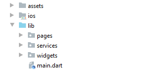
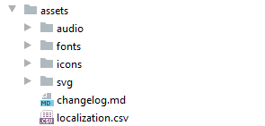
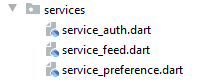
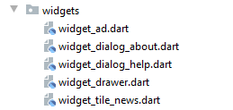
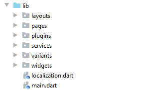
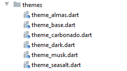

# fanoos_project

Everything you need to know to have a good flutter app structure.

# Folder structure

### Small-Medium apps

##### lib
Contains the primary folders and a few primary dart files like `main.dart` & `localization.dart`.

##### assets

Contains all external assets that are imported using the assets section of `pubspec.yaml`.

##### pages

Contains all the pages.

In small to medium apps you can have all the pages in this folder. 

##### services

Contains view context independent app logic.

##### widgets

Contains global widgets.
 
In smaller apps it contains all the widgets.
    
### Large apps

Larger apps may have more folders in lib.

here is two example extra folders that bigger projects may have: 

##### themes

Your app is probably not going to have a hundred themes, if it does, create reusable themes.

##### plugins
If you have to write your own plugin, for testing purposes, write it in the `plugins` folder
then create a new flutter plugin project and migrate 

# State management

### Services

# Naming

### File names

### Class names

### Variable names

### Widget names

# Application core

### Folder structure

